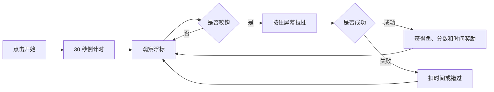

# 小猫咪休闲垂钓｜PRD 文档

## 1. 项目背景

休闲小游戏通常依赖简单规则、即时反馈和短局时循环来吸引用户反复游玩。钓鱼题材天然包含等待、观察、反应、收获和不确定性，但如果直接把鱼显示出来，玩法会变成简单点击目标，削弱钓鱼的等待感和惊喜感。

本项目以“碎片时间休闲玩家”为核心用户，设计一个 30 秒一局的微信小游戏 Demo，让玩家通过观察浮标、在咬钩瞬间按住屏幕完成拉扯判定。

## 2. 用户与问题

目标用户是希望快速开始、操作简单、但每局仍有轻微紧张感和收获反馈的休闲玩家。

核心痛点：

- 玩法如果过于直白，很快失去新鲜感
- 鱼一直可见会让玩家只是在点目标，而不是体验钓鱼
- 咬钩反馈不明显时，玩家不知道什么时候该操作
- 拉扯没有风险时，成功缺少成就感
- 局时过长会降低碎片时间打开的意愿

## 3. 产品目标

本项目将目标拆成三个层次：

- 易理解：玩家无需复杂教程即可知道等待浮标、咬钩操作和结算规则
- 有反馈：通过浮标、水花、提示语、分数和倒计时建立即时反馈
- 可重玩：用鱼类分值、稀有度、时间奖惩和最高分制造重复游玩动力

关键指标：

| 指标 | 含义 |
| --- | --- |
| 首局完成率 | 玩家是否能完整完成 30 秒一局 |
| 咬钩响应成功率 | 玩家是否能理解并响应浮标反馈 |
| 单局平均收获 | 玩家一局内钓到的鱼数量和分数 |
| 再来一局率 | 玩家结算后是否再次开始 |
| 最高分刷新率 | 玩家是否被分数目标驱动继续尝试 |

## 4. 方案设计

产品采用“等待浮标 + 咬钩反应 + 拉扯判定 + 奖励惩罚”的核心循环：

## 5. 核心页面 / 玩法

### 开始界面

展示游戏标题、开始按钮和基础规则提示，让玩家知道一局时间短、目标是尽可能钓到更多鱼。

### 等待阶段

鱼隐藏在水下，玩家主要观察浮标。等待阶段浮标轻微漂动，制造钓鱼节奏。

### 咬钩反馈

系统随机触发咬钩，浮标剧烈抖动并出现水花，同时出现“上钩了”的提示，引导玩家按住屏幕。

### 拉扯判定

玩家持续按住屏幕，让指针尽量保持在安全区域。成功后获得鱼和分数，失败则扣时间或错过。

### 结算页

时间归零后展示本局收获、总分和最高分，提供再次开始入口。

## 6. 技术实现

项目采用微信小游戏 Canvas 实现，零依赖运行。

当前 Demo 包含：

1. Canvas 场景渲染
2. 触摸输入和按住判定
3. 倒计时和局内状态管理
4. 随机咬钩时间
5. 鱼类概率、分值、难度和奖励时间
6. 失败惩罚和最高分本地保存

核心状态可拆为：未开始、等待、咬钩、拉扯、结算。状态机清晰后，后续可以继续扩展鱼竿、地图、图鉴和任务系统。

## 7. 产品取舍

本项目没有优先做复杂养成和商业化，而是先验证一局游戏的核心循环是否成立。

MVP 保留：

- 开始、倒计时和结算
- 浮标等待与咬钩反馈
- 按住拉扯进度判定
- 鱼类概率、分数和时间奖惩
- 最高分本地保存

MVP 暂不做：

- 金币商城和付费系统
- 复杂鱼竿升级
- 多地图、多天气和任务系统
- 排行榜和社交分享
- 图鉴收集和长期养成

## 8. 我的产出

- 拆解休闲钓鱼小游戏的核心体验循环
- 将“可见鱼点击”调整为“隐藏鱼 + 浮标反馈”
- 设计咬钩、拉扯、奖励和惩罚规则
- 定义鱼类概率、分值、难度和时间奖惩
- 完成微信小游戏 Demo 的 Canvas 渲染和交互实现
- 将项目整理为作品集案例页面

## 9. 后续优化方向

- 增加新手引导，降低第一次游玩的理解成本
- 增加图鉴和稀有鱼收集，提升长期目标
- 增加不同地图、水域和天气变化
- 优化拉扯判定曲线，让难度更平滑
- 增加结算页分享和好友排行，验证社交传播可能性
