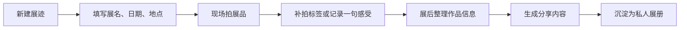

# 展迹 App 私人观展日记｜PRD 文档

## 1. 项目背景

看展用户通常会拍很多照片，也会保存票根、展签、展览信息和当下感受。但这些信息经常分散在相册、备忘录和社交平台里，展后想回看或分享时，需要重新选图、补文字、查作品信息和排版。

本项目以“高频看展用户、艺术展爱好者、内容分享用户”为核心用户，设计一个围绕观展现场轻记录和展后整理分享的移动端 App 原型。

## 2. 用户与问题

目标用户是在城市中较高频率看展、喜欢拍照记录、也有一定内容分享需求的人群。

核心痛点：

- 展厅现场不适合长时间打字，记录动作容易打断观看
- 展品照片、票根、展签、地点和感受分散，展后难归档
- 作品名称、作者、年代等信息如果现场没记，后续很难补全
- 想发社交平台时，还要重新选图、排版和整理文字
- 通用相册不理解“展览、作品、展签、观展感受”的结构

## 3. 产品目标

本项目将目标拆成三个层次：

- 现场低负担：让用户在展厅中用最少操作完成必要采集
- 展后可整理：把照片、标签、票根和感受沉淀成可回看的私人展册
- 分享可生成：降低用户二次排版成本，生成适合分享的图文内容

关键指标：

| 指标 | 含义 |
| --- | --- |
| 新建展迹完成率 | 用户是否能顺利创建一次观展记录 |
| 展品记录数量 | 单次看展中用户记录的作品数量 |
| 标签补录完成率 | 展后用户是否完成作品标签或信息补充 |
| 分享生成率 | 用户是否使用长图、九宫格或封面卡生成分享内容 |
| 回看率 | 用户是否在展后再次打开展册查看记录 |

## 4. 方案设计

产品采用“现场轻记录 + 展后整理 + 分享生成”的闭环：

## 5. 核心页面

### 展册首页

展示最近的展记、正在整理的展览和历史观展记录。这个页面用于回答“我的观展记录沉淀在哪里”。

### 新建展迹页

输入展名、日期、地点、天气和心情。MVP 中不强制用户输入完整信息，避免在现场开始前形成负担。

### 现场记录页

以拍展品为主动作，支持补拍展签、票根和记录一句感受。这个页面强调快速采集，而不是完整整理。

### 标签补录页

展后统一处理待确认作品信息，支持补充作品名称、作者、年份、展区和个人备注。

### 分享生成页

提供长图、九宫格和封面卡三种分享模式，把私人记录转成社交平台可用内容。

## 6. 技术实现

当前项目以高保真移动端原型展示核心体验，重点验证信息结构和交互路径。

MVP 可采用本地数据模拟：

1. 新建展迹后生成一条展览记录
2. 现场采集阶段保存作品照片、展签和一句话感受
3. 展后整理阶段补充作品字段
4. 分享页根据记录内容生成不同版式预览

后续如果进入真实开发，可接入 OCR 识别展签文字，并用图片聚类或时间线帮助用户自动整理观展素材。

## 7. 产品取舍

本项目没有优先做展览社区和复杂社交，而是先服务私人记录闭环。原因是看展用户最稳定的需求不是“发给别人看”，而是先把自己的观看体验保存下来。

MVP 保留：

- 展册首页
- 新建展迹
- 现场拍展品和补拍标签
- 展后标签补录
- 分享生成
- 私人展册沉淀

MVP 暂不做：

- 展览票务购买
- 展览社区动态流
- 关注、点赞和评论
- 复杂 OCR 校对流程
- 多人协作看展
- 商业化会员体系

## 8. 我的产出

- 完成观展场景拆解和用户痛点定义
- 设计看展前、看展中、看展后的核心流程
- 输出移动端高保真 UI 原型
- 设计展册首页、现场记录、标签补录和分享生成页面
- 将线下观展节奏转译成低打扰移动端交互
- 整理为作品集案例页面

## 9. 后续优化方向

- 增加 OCR 展签识别，自动提取作品名称、作者和年份
- 增加展览信息库，自动补全展览地点、展期和主办方
- 支持同一次展览下的时间线回看
- 优化分享模板，适配小红书、朋友圈和长图发布
- 通过真实看展用户测试现场记录是否足够低负担
