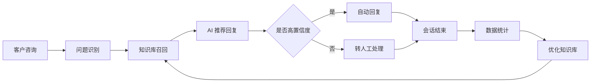

# 智客 AI 智能客服系统｜PRD 文档

## 1. 项目背景

中小电商商家在售前和售后场景中会遇到大量重复咨询，例如“什么时候发货”“可以退货吗”“有没有优惠券”“发什么快递”。这些问题高度标准化，但仍会占用客服大量时间。商家需要一个接入成本低、可持续维护知识库、能辅助人工客服的轻量级 AI 客服工具。

本项目以“客服主管和店长”为核心使用者，设计了一个覆盖知识库、会话、数据分析和 AI 推荐回复的 SaaS 产品原型。

## 2. 用户与问题

目标用户是日均咨询 100-500 条的中小商家，典型角色包括店长、客服主管和一线客服。

核心痛点：

- 重复咨询占比高，人工客服时间被低价值问题占用
- 夜间和促销高峰响应不稳定
- 客服回复质量依赖个人经验，难以标准化
- 知识库更新靠人工记忆，缺少命中率和优化反馈
- 店长只能看结果，很难定位 AI 和人工协作中的问题

## 3. 产品目标

本项目将目标拆成三个层次：

- 接待效率：降低重复问题人工处理量，缩短平均响应时长
- 回复质量：通过知识库和推荐答案提升回复一致性
- 运营复盘：用 AI 解决率、知识库命中率、人工介入率帮助商家持续优化

关键指标：

| 指标 | 含义 |
| --- | --- |
| AI 解决率 | AI 独立完成且未转人工的会话占比 |
| 知识库命中率 | 用户问题能命中有效知识条目的比例 |
| 人工介入率 | 从 AI 或自动流程转入人工的会话占比 |
| 平均响应时长 | 从客户发问到系统/客服回复的平均时间 |
| 客户满意度 | 会话结束后的评价结果 |

## 4. 方案设计

产品采用“AI 自动处理 + 人工兜底 + 数据复盘”的闭环：

## 5. 核心页面

### Dashboard 数据概览

面向店长和客服主管，优先展示今日会话量、AI 解决率、客户满意度、平均响应时长、人工介入率和知识库命中率。这个页面用于回答“今天客服系统是否健康”。

### 会话管理

面向客服主管和一线客服，支持筛选会话、查看客户画像、查看消息记录、采用 AI 推荐回复和转人工。这个页面用于回答“当前哪些客户需要处理”。

### 知识库管理

面向店长和客服主管，支持管理 FAQ、分类、扩展问法和关键词。低命中率条目会被标记出来，方便持续优化。这个页面用于回答“AI 为什么答不上，以及应该补什么知识”。

### 数据分析

面向经营复盘，展示问题类型、渠道来源、时段分布、客服绩效和 AI 洞察。这个页面用于回答“哪里还有效率提升机会”。

## 6. 技术实现

后端使用 FastAPI 提供 RESTful API，PostgreSQL 存储用户、店铺、商品、知识库、会话和消息数据。

知识库搜索采用渐进式方案：

1. 精确匹配用户常见问法
2. 通过同义词表扩展关键词
3. 使用 PostgreSQL pg_trgm 做中文友好的模糊匹配
4. 使用 Qdrant 演示向量检索思路，为后续 embedding 升级预留空间

这种设计的好处是：MVP 阶段可以低成本启动，同时保留向量检索和 RAG 的升级路径。

## 7. 产品取舍

本项目没有一开始追求复杂的多模型 Agent，而是先把客服场景拆成更可控的产品能力：知识库管理、推荐回复、人工兜底和指标复盘。

MVP 保留：

- 登录与基础账号体系
- 会话列表和消息详情
- 知识库 CRUD 与搜索
- 数据概览和分析看板
- AI 推荐回复的关键交互

MVP 暂不做：

- 真实电商平台开放接口接入
- 完整工单系统
- 多租户计费
- 大模型自动训练和自动知识抽取

## 8. 我的产出

- 完成竞品分析、用户画像和行业数据整理
- 设计 PRD、信息架构和核心指标体系
- 输出 Web 端和移动端高保真 HTML 原型
- 搭建 FastAPI 后端接口和 PostgreSQL 数据模型
- 设计知识库搜索 Demo 和 RAG 升级方向
- 将项目整理为可阅读、可演示、可扩展的作品集案例

## 9. 后续优化方向

- 用真实业务样本补充知识库评测集
- 为 AI 推荐回复增加置信度、来源引用和采用反馈
- 增加会话质检和客服绩效复盘模块
- 将移动端定位为店长随身查看和紧急处理工具
- 将 Web 端视觉进一步收敛为专业 SaaS 管理后台风格
